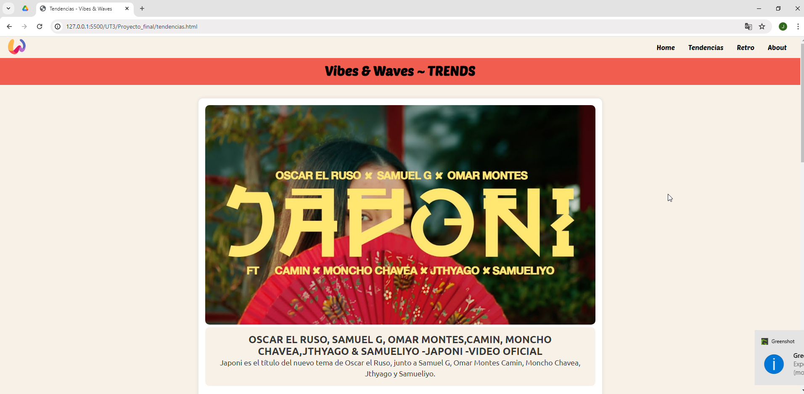
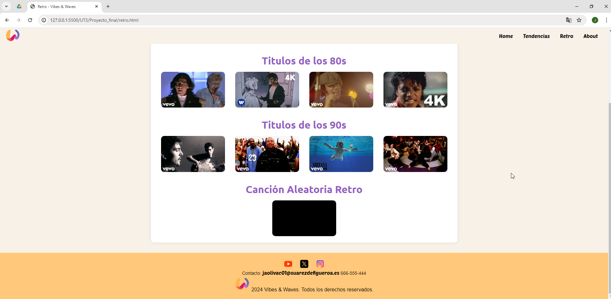

**Readme**

- Nombre del proyecto.

El nombre de la página web es: Vibes & Waves

- Descripción del proyecto.

Es una página web de noticias y recomendaciones en el ámbito musical. Se compone de varias páginas, una primera página principal donde encontramos un poco de todo además de un sidebar que muestra canciones en directo. Una segunda página que muestra el top de canciones en tendencias. Una tercera página que recomienda canciones retro cada dia de diferentes épocas. Y una cuarta página about que sirve para mostrar a los usuarios para que sirve dicha página y cual es su objetivo.

- Tecnologías utilizadas.

Se ha utilizado Visual Studio Code, utilizando formato html y css.

- Autor/a.

Alumno: José Antonio Oliva Cortés

- `Colores y tipografías`: Información sobre los colores y tipografías utilizadas.

  - Colores utilizados: Indicar los colores principales, secundarios y de fondo.

  Los colores utilizados se encuentran en un css principal para todas las páginas y los cuales son principalmente: naranja, rojo y violeta, en sus versiones soft e intense.

  Para el fondo de la página se ha decidido utilizar un color suave en lugar de blanco.

  A corde al logotipo que he utilizado que mantiene colores similares a los utilizados en la página para mantener una armonia colorida.

  Cada sección además utiliza diferentes tonalidades para ayudar al usuario a ver rápidamente donde se encuentra, también añadí un page-header colorido a cada página que sirve como introducción, roja para las tendencias y violeta para el apartado retro. Aun así mantienen la esencia base con los colores de la página principal en el fondo.

  - Tipografías utilizadas: Indicar las tipografías utilizadas.

  Las fuentes utilizadas han sido sacadas de Google Fonts, Poetsen One y Ubuntu.
  La primera fuete la he utilizado para el nombre de la página en el page-header, y en el resto del texto he utilizado la segunda fuente.
  Estos son los enlaces a las tipografías:

  Poetsen One:
  https://fonts.google.com/specimen/Poetsen+One

  Ubuntu:
  https://fonts.google.com/specimen/Ubuntu?preview.layout=grid

- `Despliegue`: Informacón para acceder a la página/sitio web.

  - Web utilizada para desplegar la página/sitio web.: [GitHub Pages](https://pages.github.com/), [Netlify](https://www.netlify.com/), [Vercel](https://vercel.com/), ...

  La web utilizada ha sido GitHub Pages

  - URL de acceso: [URL](#).

  La url de la página desplegada: https://jaolivac.github.io/githubpage/

- `Fuentes/Recursos utilizados`: Indicar las fuentes y recursos utilizados para la realización del proyecto.

  - Indicar cualquier página utiliza para obtener recursos o cualquier utilidad

  Para obtener las imágenes de las miniaturas de los videos he utilizado un convertidor de miniaturas de videos (thumbnails): https://www.get-youtube-thumbnail.com/

  Para el logo y otros iconos que se encuentran por la página he utilizado la página icons8: https://icons8.com/

- `Capturas de pantalla`: Capturas de pantalla de la página/sitio web.
  - Adjuntar capturas de pantalla de la página principal y/o secundarias.
  - Hacer un video (gif) de la página/sitio web si es Responsive.

Capturas:

Gif (Responsive):

